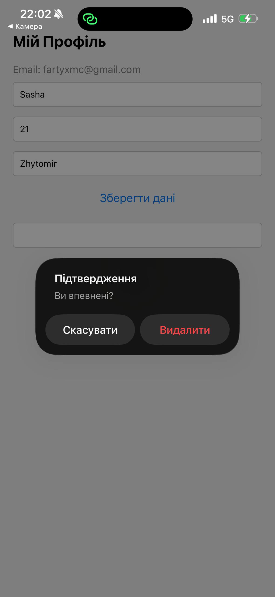

# Лабораторна робота №6: Побудова авторизації та збереження персональних даних у React Native

**Виконав:** Ганчевський Олександр Олександрович, група ІПЗ-22-2

## Опис реалізованого функціоналу

У рамках лабораторної роботи було розроблено мобільний застосунок з інтеграцією **Firebase Authentication** та **Firestore Database**[cite: 13].

**Основні реалізовані можливості:**

1. **Авторизація користувача:** Можливість реєстрації, входу та виходу з системи за допомогою email та пароля[cite: 13].
2. **Збереження даних:** Після входу користувач може заповнити свій профіль (ім'я, вік, місто). Дані зберігаються у колекції `users` у Firestore під документом, що дорівнює `uid` користувача[cite: 13].
3. **Захист доступу:** Доступ до екрану профілю захищено через Expo Router (`_layout.tsx`). У Firebase прописані Security Rules, що дозволяють запис/читання документа лише його власнику (`request.auth.uid == userId`)[cite: 13].
4. **Видалення акаунта:** Реалізовано кнопку видалення облікового запису. Оскільки Firebase вимагає свіжої автентифікації для цієї дії, користувач повинен підтвердити видалення введенням свого поточного пароля (`reauthenticateWithCredential`)[cite: 13].
5. **Відновлення паролю:** Окремий екран для скидання пароля через відправку email (`sendPasswordResetEmail`)[cite: 13].

---

## Скріншоти роботи застосунку

<div style="display: flex; gap: 10px; flex-wrap: wrap;">
  
  
  
  
  
</div>

---

## Інструкція із запуску

1. Перейти в директорію проєкту:
   ```bash
   cd MobileLabsRN2026/lab6
   ```
2. Встановити залежності:
   ```bash
   npm install
   ```
3. Переконатися, що у файлі src/config/firebase.ts вказані актуальні ключі вашого Firebase проєкту.

4. Запустити сервер:
   ```bash
   npx expo start -c
   ```
